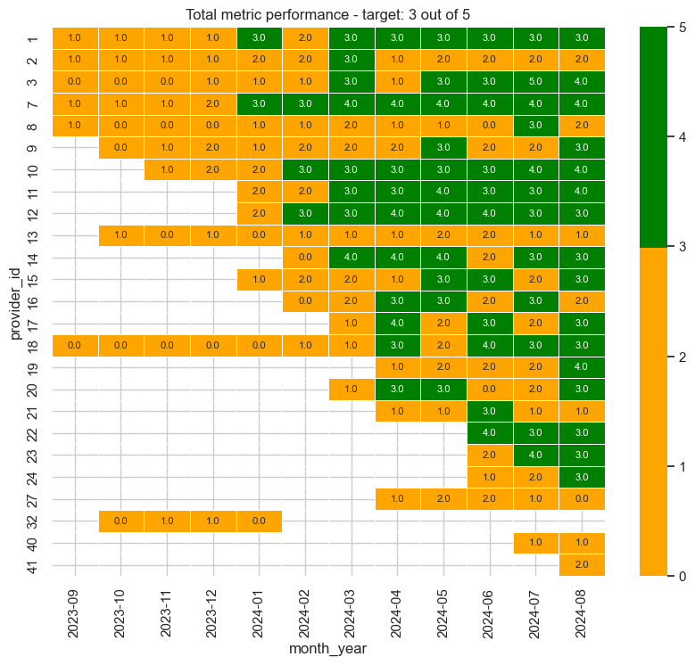

## Objectives

This analysis aims to:

* Identify consistently underperforming providers (missing 3+ targets out of 5 over the last 3 months).
* Determine the top 5 providers with the greatest improvement in MIC utilization rate.

## Deliverables
| Task Summary | SQL File | SQL Output File | Note |
| --- | --- | --- | --- |
| Underperforming Providers | [task_1_underperforming_providers.sql](scripts/task_1_underperforming_providers.sql) | [task_1_underperforming.csv](output/task_1_underperforming.csv) | Found provider 2, 13, 27, and 32 to be underperforming |
| MIC Utilization Improvement | [task_1_mic_utilization_improvement.sql](scripts/task_2_mic_improvement_by_providers.sql) | [task_1_output_mic_utilization.csv](output/task_1_output_mic_utilization.csv) | Found provider 19, 21, 3, 8, and 16 to have improved MIC utilization by largest margin |

## Process Details

Before querying, a data quality check was conducted to ensure:

* Complete data for all 25 providers and 5 metrics.
* Unique records per provider, metric, and month.
* Continuous monthly data for all metrics and providers.

Detailed data quality checks are documented in [data_quality_check](docs/01_data_quality_check.ipynb). The data quality check flagged that some metrics do not have continuous monthly data, and the data needs to be modified to add rows for missing months. This step can be seen in [data_cleaning_and_transformation](docs/02_data_cleaning.ipynb).

Prior to constucting SQL queries, data transformation steps are tested as python script as documented in [data_transformation](docs/03_data_transformation.ipynb), which then were translated into SQL queries.

The raw data is uploaded to [personal snowflake instance](https://qsoynix-neb04412.snowflakecomputing.com/console/login#/), and SQL queries were constructed and executed in Snowflake's default UI (snowsight). 

1. The raw data is uploaded to `PUBLIC.RULA_CASE_STUDY.PUBLIC.PROVIDER_MONTHLY_METRICS`
1. Three dimensional tables are created to correct the missing date range issue:
    * Date spline table is created using the [create_monthly_date_spline](scripts/create_monthly_date_spline.sql)
    * Metrics name table is created using the [create_metric_name](scripts/create_metric_name.sql)
    * Provider ID talbe is created using the [create_provider_id](scripts/create_provider_id.sql)
    * Script to identify underperforming provider is created - [task_1_underperforming_providers.sql](scripts/task_1_underperforming_providers.sql). Its output is stored as [task_1_underperforming.csv](output/task_1_underperforming.csv).
    * Script to identify underperforming provider is created - [task_1_underperforming_providers.sql]. Its output is stored as [task_1_output_mic_utilization.csv](output/task_1_output_mic_utilization.csv).

## Results and Discussions

### Identification of Underperforming Providers:

The result of sql queries were corroborated by visual inspection of the heatmap created in [04_visualize.ipynb](../../docs/04_visualize.ipynb). They both identifies Providers 2, 13, and 27 as consistently underperforming. These providers failed to meet targets for more than three key metrics over the preceding three months, as visualized in the figure below..

It should be noted that following providers are omitted:
* provider 32 is not included, as there has not been metric entries since 2024-01
* provider 40 and 41 does not have full three month of recent data

### MIC Utilization Improvement

* MIC utilization improvements were assessed using three distinct methodologies:
Absolute Change in Metrics Score: The difference between the initial non-zero MIC utilization score and the final recorded score.
* Percentage Change in Metrics Score: The absolute change in metrics score divided by the initial non-zero MIC utilization score, expressed as a percentage.
* Average Monthly Metrics Change: The absolute change in metrics score divided by the number of months with reported MIC utilization rates.

The following table presents the ranking of providers based on each evaluation method:

| Provider | Rank by Change in Metrics Score | Rank by Percent Change in Metrics Score | Rank by Monthly Metrics Change |
| --- | --- |   --- | --- |
| 19 | 1 | 3 | 2 |
| 21 | 2 | 5 | 1 |
| 3  | 3 | 6 | 3 |
| 8  | 4 | 8 | 7 |
| 16 | 5 | 9 | 6 |

The rankings derived from absolute change and monthly change exhibited strong correlation. However, the percentage change ranking deviated significantly. This discrepancy is attributed to the inherent sensitivity of percentage change calculations to small initial metric values, which can result in disproportionately large percentage increases.

Given the potential for skewed results due to small initial values in percentage change, the absolute change in metrics score was selected as the primary metric for determining the top five providers demonstrating MIC utilization improvement. This method provides a more stable and representative measure of actual improvement