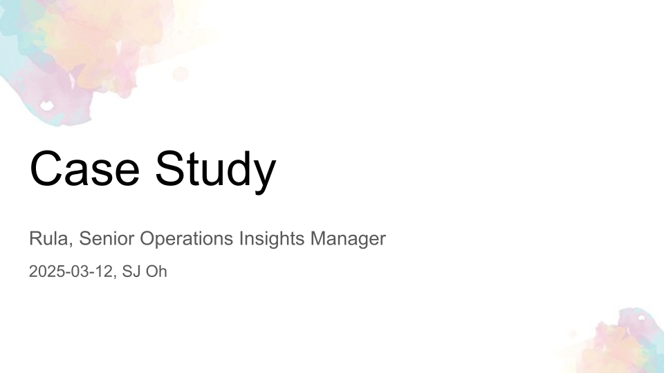
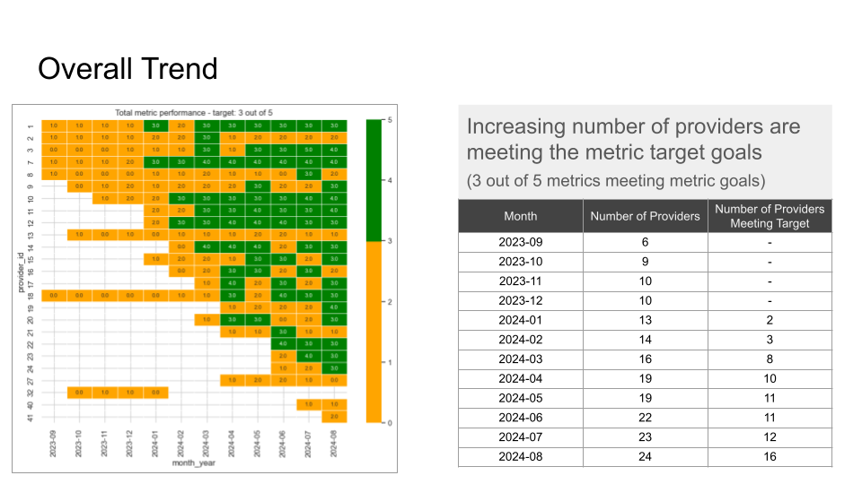
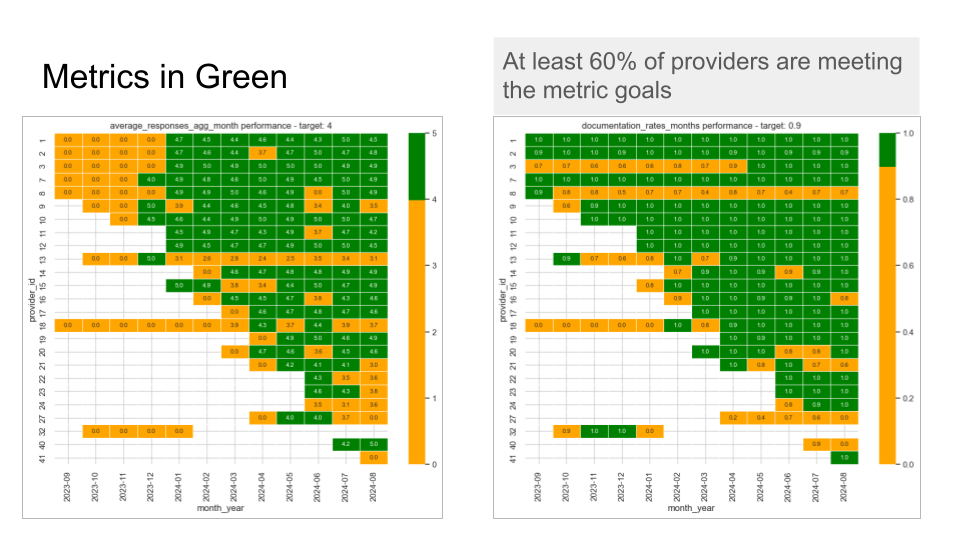
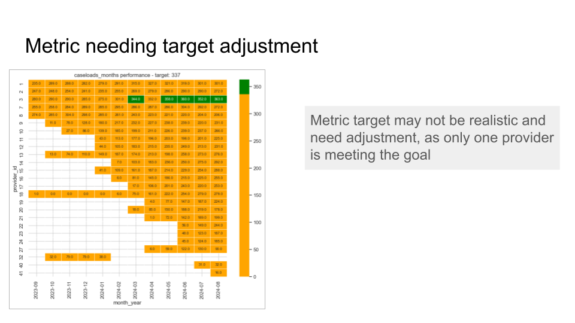
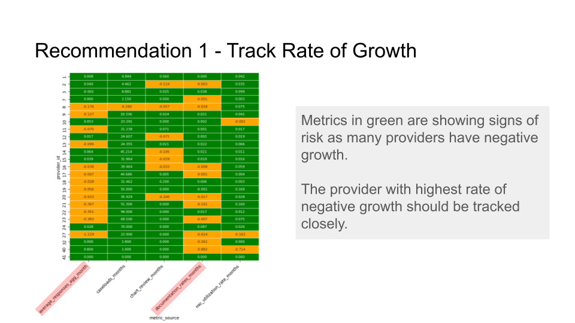
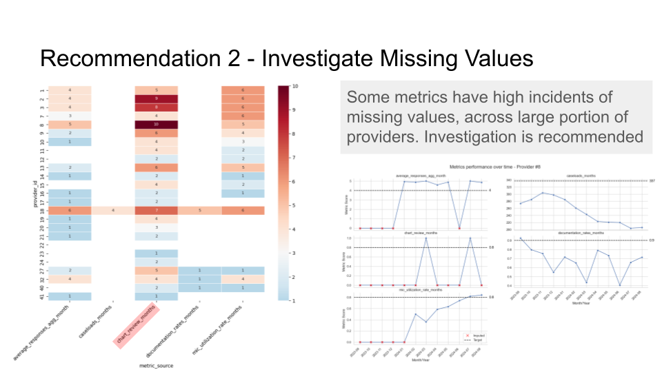
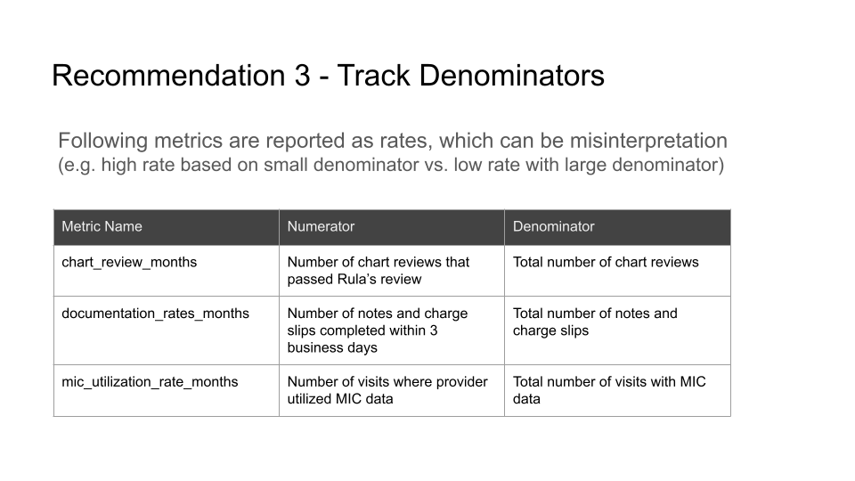
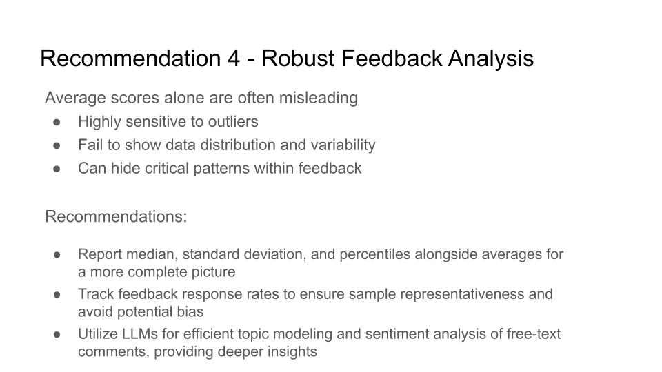

## Objectives

Write a document for the psych management team that shows overall performance across these metrics. 

* Highlight trends, 
* diagnose gaps goals, and 
* identify recommendations you would make to close them (could be hypotheses you’d want to test if you had more data as well)

## Deliverables

The slide deck can be viewed via [Google Slide](https://docs.google.com/presentation/d/1oM61u2iOdeQ4miUEhhc--Pk2ftz6OA8KyrWZk5pWLDk/edit?usp=sharing).

## Slide Decks

